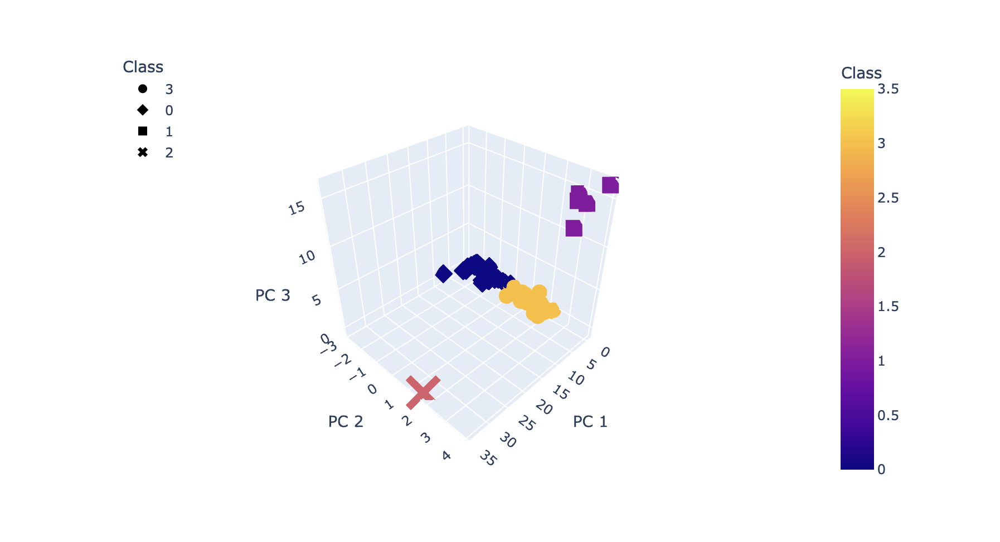
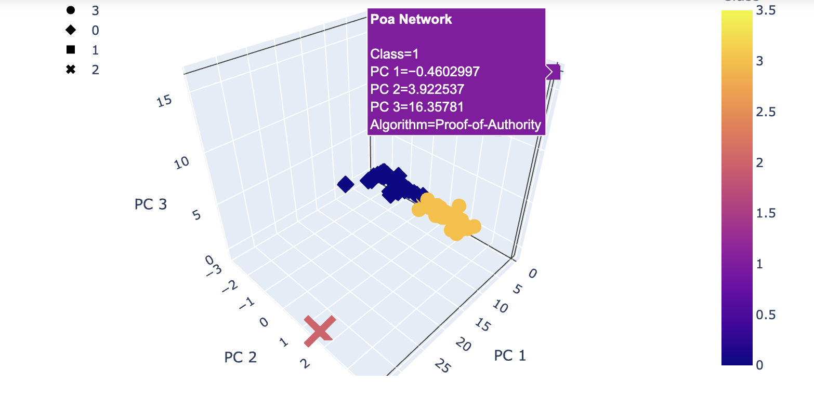
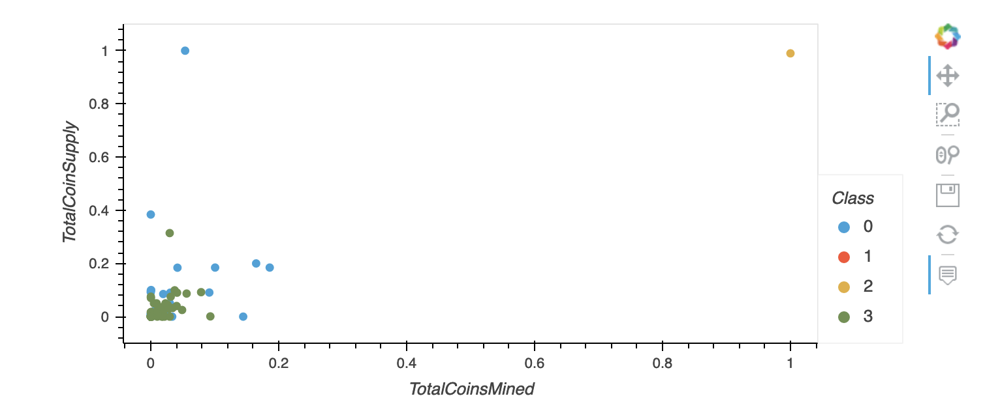
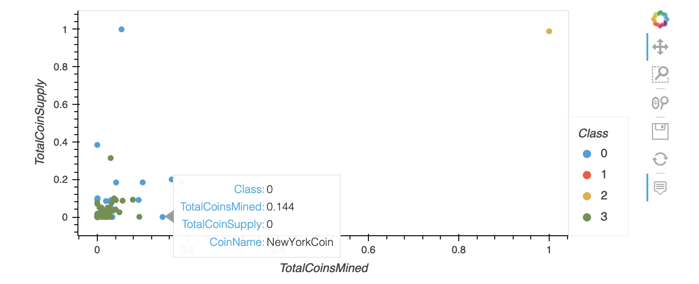

# Analysis of the Cryptocurrency Market

## Overview

The purpose of this project is the create a report for an investment bank interested in offering a new cryptocurrency investment portfolio. The report includes what cryptocurrencies are on the trading market and how they could be grouped to create a classification system for this new investment. In order to complete this project, I am performing unsupervised machine learning functions on data provided by CryptoCompare.

## Results

I started by cleaning up the data to only have cryptocurrencies that are actively trading, have a defined algorithm, and have a complete set of data. This left me with 532 different cryptocurrencies. From there, I created a 3D graph to show how the different cryptocurrencies are grouped together. Each point includes the name as well as the algorithm used to create the currency.

After that, I created a 2D graph to show the relationship between total coin supply and total coins mined to show how each currency compares to the rest. Each point includes its currency name.

## Summary

On the 3D graph you can see that there are four different groups. Two groups are clumped very closely together with most currencies falling into one of these two groups. One group has a few different currencies that are farther away from the others, and then there is the last group that only has one currency. This shows that there are lot of currencies that perform similarly while there are a few that are outliers. These outliers could be over performers or under performers, but I would need to perform more analysis to figure that out. One thing that I can connect is by looking at the total coin supply vs total coins mined graph. The two main groups have most of their data points scattered between 0% and 40% of the largest currency based on volume. The group with a few currencies are are very close to 0% of the largest currency, while the group with just one currency is at 100% as it is the largest currency.

I would want to complete further analysis on these cryptocurrencies by looking at their historical pricing to understand the performance of each of these currencies. This would help investors know how stable or risky their investment would be based on the the different cryptocurrencies they invest in.
